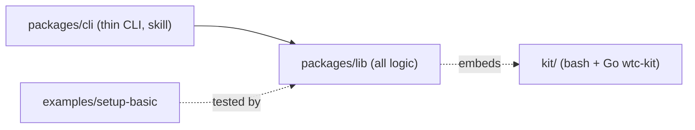

# Development

Setup authors: see [docs/authoring-setup.md](docs/authoring-setup.md). End-user install: [README.md](README.md).

- **Install:** `bun install`
- **Test:** `bun test` (integration tests only with `WTC_INTEGRATION=1`); the skill test ([packages/cli/test/skill.test.ts](packages/cli/test/skill.test.ts)) fails if SKILL.md misses a command or error code.
- **Integration tests (real docker):** `WTC_INTEGRATION=1 bun test examples/setup-basic` runs [examples/setup-basic/test/integration.test.ts](examples/setup-basic/test/integration.test.ts) against the example setup [examples/setup-basic](examples/setup-basic) (copied under `~/.cache/wtc-it/` because colima only shares `$HOME`; id `wtcit`, socks ports 22080-22179, host port 16379 must be free). `afterAll` removes every `wtc.setup=wtcit` container/volume and the `wtc-wtcit` image (`WTC_IT_KEEP_IMAGE=1` keeps the image).
- **Agent end-to-end (real logins, spends tokens):** `WTC_AGENT_E2E=1 bun test examples/setup-basic/test/agent.e2e.test.ts` runs [agent.e2e.test.ts](examples/setup-basic/test/agent.e2e.test.ts): auto-install, real `claude -p` / `codex exec` tasks, synced state checks (id `wtcag`, socks ports 22280-22379).
- **Typecheck:** `bun run typecheck`
- **Setup authoring guide / kit scripts:** [docs/authoring-setup.md](docs/authoring-setup.md); kit cache is `~/.cache/wtc/kit/<version>-<arch>-<contenthash>/` (`WTC_CACHE_DIR` overrides the root).
- **Layout:** `packages/lib` (core logic, [src/index.ts](packages/lib/src/index.ts)), `packages/cli` (thin CLI, [src/main.ts](packages/cli/src/main.ts))
- **Design:** [docs/superpowers/specs/2026-09-30-wtc-design.md](docs/superpowers/specs/2026-09-30-wtc-design.md); `wtc agent`: [2026-10-01-wtc-agent-design.md](docs/superpowers/specs/2026-10-01-wtc-agent-design.md)
- **Kit:** container helper `wtc-kit` (Go, [kit/go](kit/go)) + scripts in [kit/bin](kit/bin); `bun run build:kit` ([kit/build.sh](kit/build.sh)) cross-compiles to `kit/dist/` (gitignored; `bun test` builds it if missing via [kit/test/preload.ts](kit/test/preload.ts)). Embedded/extracted by [packages/lib/src/kit/embed.ts](packages/lib/src/kit/embed.ts). Go tests: `cd kit/go && go test ./...`.
- **Instance lifecycle:** up/start/stop/restart/rm/ls/status in [packages/lib/src/instance/instance.ts](packages/lib/src/instance/instance.ts); container spec in [create-spec.ts](packages/lib/src/instance/create-spec.ts), socks port allocation in [ports.ts](packages/lib/src/instance/ports.ts), params in [params.ts](packages/lib/src/instance/params.ts), known_hosts in [ssh.ts](packages/lib/src/instance/ssh.ts). Host state lives in `<setup>/.wtc/{run,log}/<name>/`.
- **Ops + facade:** `createWtc` in [packages/lib/src/wtc.ts](packages/lib/src/wtc.ts); build (single image-build impl, used by `up`) in [ops/build.ts](packages/lib/src/ops/build.ts), run/check/shell in [ops/exec.ts](packages/lib/src/ops/exec.ts), agent runner in [ops/agent.ts](packages/lib/src/ops/agent.ts) (definition API in [agent/define.ts](packages/lib/src/agent/define.ts), built-in claude / codex definitions and host config collection in [src/agent/](packages/lib/src/agent)), [logs.ts](packages/lib/src/ops/logs.ts), [tunnel.ts](packages/lib/src/ops/tunnel.ts), [open.ts](packages/lib/src/ops/open.ts), [gc.ts](packages/lib/src/ops/gc.ts), [doctor.ts](packages/lib/src/ops/doctor.ts).
- **CLI:** commands in [packages/cli/src/main.ts](packages/cli/src/main.ts) (zero business logic), rendering in [render.ts](packages/cli/src/render.ts), agent guide in [packages/cli/skill/SKILL.md](packages/cli/skill/SKILL.md) (embedded; tests in [packages/cli/test](packages/cli/test) enforce every command and `WtcError` code is listed). `WTC_FAKE_RUNTIME=1` swaps in `FakeRuntime` (tests only).
- **Build:** `bun run build` = `build:kit` + `bun build --compile` -> `dist/wtc` (gitignored, embeds kit + SKILL.md). The CLI registers a Bun plugin ([main.ts](packages/cli/src/main.ts)) that serves `wtc` and `@wtc/lib` as virtual modules, so a user's `wtc.setup.ts` can `import { defineSetup } from "wtc"` in both `bun` and compiled modes (no editor types for `wtc` yet; a plain `export default {...}` also works).
