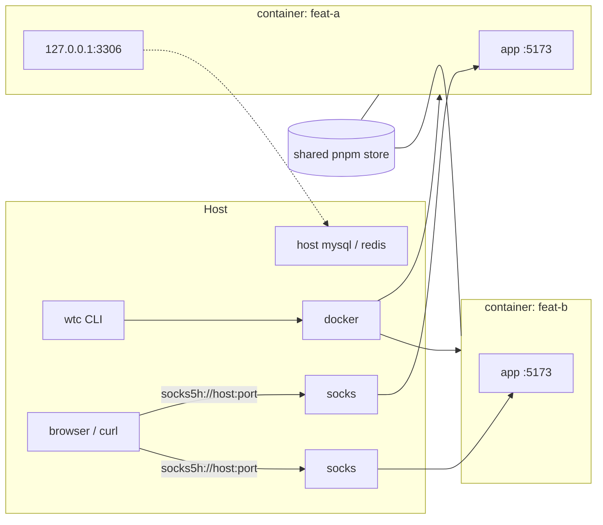
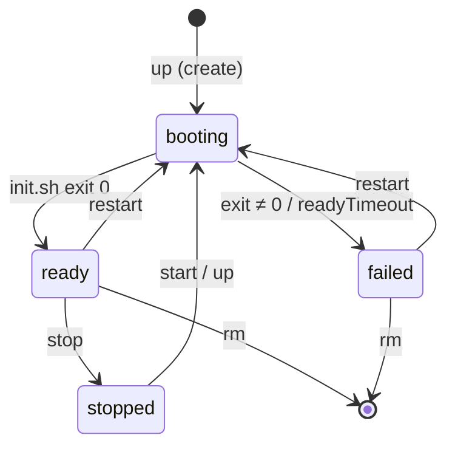

# wtc — worktree containers

Run one long-lived docker container per branch / worktree, so several copies of the same project can run side by side on one machine.

- **Same ports everywhere**: every instance has its own network namespace. `feat-a` and `feat-b` can both serve on `127.0.0.1:5173` without conflict.
- **Fast installs**: all instances of a setup share one pnpm store volume, so a warm `pnpm install` takes seconds, not minutes.
- **Reach it from anywhere**: each instance gets a SOCKS5 tunnel. Your browser, `curl`, or a phone on the LAN can open the container's `127.0.0.1` services.
- **Host services inside**: `hostForwards` makes host databases (e.g. mysql, redis) appear on the container's `127.0.0.1`.
- **Project-agnostic**: what to clone, install and start lives in a *setup* directory. wtc only provides the lifecycle.



## Requirements

- **Docker** on Linux, or on macOS via [colima](https://github.com/abiosoft/colima). Docker Desktop and OrbStack are untested.
- **Build from source**: [Bun](https://bun.sh) and [Go](https://go.dev) ≥ 1.25 (see [kit/go/go.mod](kit/go/go.mod)). Go cross-compiles the in-container helper `wtc-kit`.
- On colima, keep setup directories and bind-mount sources under `$HOME`. colima only shares `$HOME` with its VM.
- On colima, `wtc open` needs VS Code / Cursor to see colima's socket. colima has no `/var/run/docker.sock`, so a GUI-launched editor fails with "Cannot attach to the container ... no longer exists". Run `launchctl setenv DOCKER_HOST unix://$HOME/.colima/default/docker.sock`, then fully quit and reopen the editor. The setting is per login session (lost on reboot); `.bash_profile` only helps editors started from that shell.

## Install

```sh
git clone https://github.com/lyonbot/wtc.git && cd wtc
bun install
bun run build          # -> dist/wtc: single binary with the container kit embedded
cp dist/wtc ~/.local/bin/   # or anywhere on your PATH
wtc doctor             # checks docker, colima mounts / agent forwarding, toolchain; warns on NO_PROXY localhost bypass
```

## Quickstart

Try the reference setup [examples/setup-basic](examples/setup-basic). It runs a tiny dev server on port 5173. To start your own, `wtc init <dir>`.

```sh
cd examples/setup-basic
wtc up feat-a                 # build image, create container, block until ready / failed
wtc up feat-b --set APP_GREETING=hi
wtc ls                        # NAME STATE PHASE SOCKS IMAGE REMARK
wtc remark feat-a "fixing login bug"   # note shown by ls / tui; inside the container: wtc-remark
wtc tunnel feat-a             # prints socks5h://<ip>:<port> URLs
NO_PROXY= no_proxy= curl --socks5-hostname <ip:port from tunnel> http://127.0.0.1:5173/   # -> hello from feat-a
wtc run feat-a restart-dev-server
wtc run --host feat-a show-url   # a `hostScripts` entry, runs on this machine
wtc run                          # list all scripts, both kinds
wtc rm feat-a                 # runs the setup's preRemove guard first
```

Bare `wtc` (or `wtc --setup <dir>`) opens the console in an interactive terminal with a resolvable setup; it prints help when piped, in CI or agent shells, or with `WTC_NO_TUI=1` (full list: [src/cli/interactive.ts](packages/wtc/src/cli/interactive.ts)).

The setup is resolved from `--setup <dir>`, then `$WTC_SETUP`, then the nearest `wtc.setup.ts` above the current directory.

If the setup has its own `@lyonbot/wtc` in `node_modules` at a different version, that one runs instead, except for `init` (set `WTC_NO_FORWARD=1` to disable).

**The tunnel address is dynamic.** Run `wtc tunnel <name>` whenever you need it; don't hardcode the port. Always use `socks5h://`, which resolves DNS inside the container. Also make sure `localhost` / `127.0.0.1` is not in the client's `NO_PROXY` or `no_proxy`, or it will skip the proxy (`wtc doctor` warns).

## Commands

| Command | What it does |
|---|---|
| `init [dir] [--id <id>]` | scaffold a new setup ([src/ops/init.ts](packages/wtc/src/ops/init.ts)); needs no existing setup |
| `up <name> [--set K=V]` | create, start or wait until `ready`; safe to re-run |
| `start` / `stop` / `restart <name>` | stop keeps code and `node_modules`; restart re-runs `init.sh` |
| `rm <name> [--force]` | `preRemove` guard, then delete container, volumes and state |
| `ls`, `status <name> [--watch]`, `logs <name> [-f]` | inspect instances and init logs |
| `run [--host] <name> <script>`, `check <name>`, `shell <name>` | run a setup script (in the container, or a `hostScripts` entry on the host with `--host`; bare `run` lists both), health checks, or open a shell |
| `agent <name> <claude\|codex\|custom> [-- args]` | run Claude Code / Codex (or a custom agent from `wtc.setup.ts`) inside the container with your host login ([details](docs/authoring-setup.md#coding-agents-wtc-agent)) |
| `tunnel <name>`, `open <name> [code\|cursor]` | SOCKS URLs; open the container in an editor |
| `tui` (or bare `wtc` in a terminal) | interactive console: live list (state, CPU, memory, remark), create form with param completion, per-instance action menu ([details](docs/authoring-setup.md#host-scripts-and-param-suggestions-wtc-tui)) |
| `build`, `gc`, `doctor`, `skill` | image build, cleanup, environment check, agent guide |

Most commands take `--json`. The full reference with flags and error codes is [packages/wtc/skill/SKILL.md](packages/wtc/skill/SKILL.md).

## Instance lifecycle



`init.sh` runs on every boot, so it must be idempotent. A failed instance keeps its container running so you can `wtc shell` into it and look around.

## Writing your own setup

A setup is a directory with `wtc.setup.ts` (manifest), `image/Dockerfile`, `init.sh` and optional `scripts/`. Start by copying [examples/setup-basic](examples/setup-basic).

- Guide (init contract, pnpm and platform gotchas, private git, SOCKS exposure): [docs/authoring-setup.md](docs/authoring-setup.md)
- Manifest fields: [packages/wtc/src/setup/schema.ts](packages/wtc/src/setup/schema.ts)

> **Security note:** the SOCKS port binds `0.0.0.0` by default. Anyone on your LAN can reach the container's `127.0.0.1` services and, through the container, the host. Set `socksBind: "127.0.0.1"` or `socksAuth` to restrict it. See [SOCKS exposure](docs/authoring-setup.md#socks-exposure).

## Using wtc from an AI agent

`wtc skill > .claude/skills/wtc/SKILL.md` installs the agent guide ([packages/wtc/skill/SKILL.md](packages/wtc/skill/SKILL.md)).

## More

- Contributing, tests, code layout: [DEVELOPMENT.md](DEVELOPMENT.md)
- Design spec (Chinese): [docs/superpowers/specs/2026-09-30-wtc-design.md](docs/superpowers/specs/2026-09-30-wtc-design.md)
