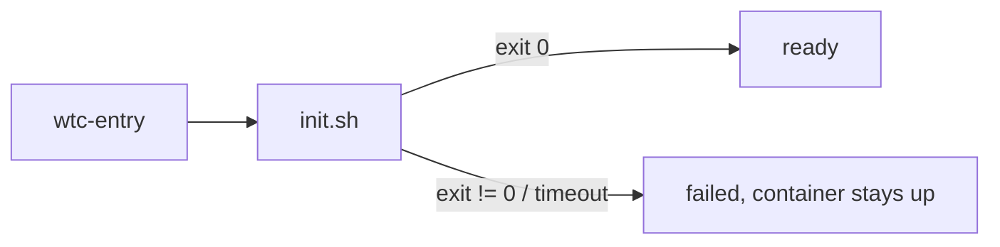
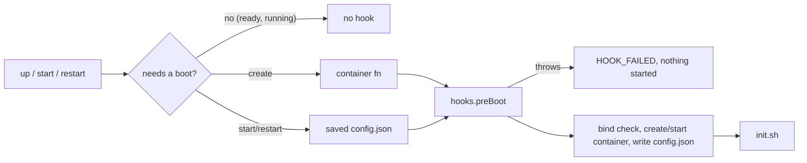
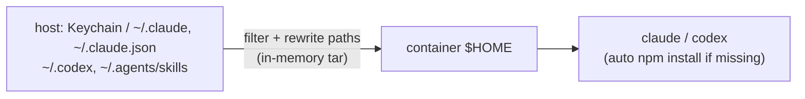

# Authoring a wtc setup

A setup is a directory describing how to build and initialise one container per git worktree. Start from [examples/setup-basic](../examples/setup-basic); design rationale lives in [the spec](superpowers/specs/2026-09-30-wtc-design.md).

## Layout

- [wtc.setup.ts](../examples/setup-basic/wtc.setup.ts): `export default defineSetup({...})`; `defineSetup` is imported from `"@lyonbot/wtc/setup"` ([packages/wtc/src/setup/index.ts](../packages/wtc/src/setup/index.ts)). For editor types, put a `package.json` with `@lyonbot/wtc` as a devDependency in the setup dir (template: [package.json](../examples/setup-basic/package.json), [tsconfig.json](../examples/setup-basic/tsconfig.json); its `scripts` can call `wtc` directly); without it the CLI still resolves the import at runtime via a virtual module, but the editor has **no types** (no completion, import shown unresolved) ([packages/wtc/src/cli/main.ts](../packages/wtc/src/cli/main.ts)).
- Manifest fields, defaults and validation: [packages/wtc/src/setup/schema.ts](../packages/wtc/src/setup/schema.ts) (the only field reference).
- [image/Dockerfile](../examples/setup-basic/image/Dockerfile): default build context. Editing `init.sh` / `scripts/` never rebuilds the image (they are mounted read-only at `/wtc/setup`).
- [init.sh](../examples/setup-basic/init.sh) and [scripts/](../examples/setup-basic/scripts/restart-dev-server.sh): container-side logic.
- `.wtc/` (gitignored): host-side run state and logs.
- Relative `bind` mount sources resolve against the setup dir; `~` expands to `$HOME`.

## init.sh contract

Runs on every container boot (including VM/colima restarts, `wtc restart`). Implementation: [kit/bin/wtc-entry](../kit/bin/wtc-entry).

- **Idempotent**: guard clone/copy steps (see the `[ ! -d ... ]` check in the example).
- **Must exit.** Exit code `0` = `ready`, non-zero = `failed`; exceeding `readyTimeout` also fails it. There is no separate ready signal.
- **Progress**: `wtc-signal phase <name> [msg]` ([kit/bin/wtc-signal](../kit/bin/wtc-signal)). Conventional names: `clone`, `install`, `start`.
- **Install**: `wtc-install [-C dir] [pnpm args]` ([kit/bin/wtc-install](../kit/bin/wtc-install)). Signals `install`, takes a shared lock on the pnpm store, runs `pnpm install --frozen-lockfile --prefer-offline`.
- **Long-running services** (dev servers): start detached in tmux, wait for them to be healthy, then exit. See [restart-dev-server.sh](../examples/setup-basic/scripts/restart-dev-server.sh).
- Output is teed to `.wtc/log/<name>/init.<bootId>.log` (`wtc logs`).
- A failed init leaves the container running for `wtc shell`; `wtc restart` reruns it.



## Per-instance config: `container`

`mounts`, `hostForwards`, `env` and `annotations` live under `container`. They are fixed when the instance is created, so they come either from a static object or from **one function** (no merging of two sources); typical use is a config that depends on `wtc up --set K=V`.

- Types and JSDoc: `ContainerConfig`, `ContainerFn` in [packages/wtc/src/setup/schema.ts](../packages/wtc/src/setup/schema.ts); evaluation and validation in [packages/wtc/src/instance/container.ts](../packages/wtc/src/instance/container.ts).
- **Mount shapes** (`target` must be unique and not under `/wtc` or `/pnpm`; `readonly` optional): `{ type: "bind", source, target }` (`~` / relative allowed), `{ type: "volume", name, target, scope: "setup" }` (one docker volume shared by all instances of this setup), `{ type: "volume", name, target, scope: "instance" }` (one per instance, removed by `wtc rm`), `{ type: "volume", external: "<existing docker volume>", target }`. Volume `name` follows the id rule (lowercase, digits, single `-`).
- **`env`** keys match `^[A-Z_][A-Z0-9_]*$`; `hostForwards` ports are 1-65535 and must not equal `socksPort` (default `1080`, the SOCKS listener inside the container, so the port is taken). Params are declared as `params: { STAGE: { description, default?, required?, pattern? } }`; `pattern` (regexp) restricts allowed `--set` values; each param becomes a container env var of the same name.
- The function gets `{ name, params, setupDir }`, where `setupDir` is the **host** path of the setup dir (the same dir is `/wtc/setup` inside the container; use `/wtc/setup/...` in `init.sh` and scripts, never `setupDir`), may be async, and runs **once, at create** (`start` / `restart` never re-evaluate). Throwing -> `HOOK_FAILED` (message starts `container() failed for <name>:`; a failing `preBoot` says `hooks.preBoot failed for <name> (<event>):`); a bad result (schema, duplicate mount `target`, `hostForwards` containing `socksPort`, `env` key that is a param or starts with `WTC_`, missing bind source) -> `INVALID_MANIFEST`.
- **Snapshot**: what was actually used is saved to `<setup>/.wtc/run/<name>/config.json` (`/wtc/run/config.json` in the container): `{ params, container, spec }`. There is no `wtc` command that prints it; `cat` the file.
  - `container.mounts[].source` is as written (`~` expanded to `$HOME`, relative paths still relative); `spec.mounts` holds the resolved absolute paths and `spec` is the docker-level container spec.
  - Redaction: only `WTC_SOCKS_PASS` inside `spec.env`. `params` and `container.env` are stored verbatim (docker shows container env anyway), so keep secrets out of them.
- **Annotations**: `annotations` is free-form string metadata for your own tooling (wtc never interprets it), also mirrored to docker labels `wtc.ann.<key>`, which is where `wtc ls/status --json` read `annotations` from (`wtc status` text prints `ann:` lines; the `ls` table does not). Limits (rejected with `INVALID_MANIFEST`, never truncated): keys are lowercase alphanumerics separated by `.` / `-`; each label (prefix + key + value) at most 4096 bytes; at most 64 annotations. Docker itself accepted 1 MB labels in a local check, but the cap keeps labels portable (containerd uses 4096) and `docker inspect` readable; put bigger payloads in your own files. The function only knows `name`, `params` and `setupDir`; to record e.g. a branch, take it as a param (`--set BRANCH=feat-x` -> `annotations: { branch: params.BRANCH }`).
- **Immutable after create**:
  - To change mounts / forwards / env, run `wtc rm <name>` then `wtc up <name> [--set ...]`. `wtc up <name> --set K=V` on an existing instance with a different value fails with `PARAMS_MISMATCH` before any hook or function runs (the same value is a no-op). If a create fails before the container exists, nothing is saved and the next `up` evaluates the function again.
  - `rm` deletes the container, its `scope: "instance"` volumes and `.wtc/{run,log}/<name>/`; `scope: "setup"` volumes and the shared pnpm store stay.
- **Validation**: `--set` keys must be declared in `params` (`PARAM_UNKNOWN`). Unknown top-level manifest keys, including the old top-level `mounts` / `hostForwards`, fail with `INVALID_MANIFEST` (for every command, since each loads the manifest).

## Host scripts and param suggestions (`wtc tui`)

`wtc tui` ([packages/wtc/src/tui/](../packages/wtc/src/tui/app.ts)) lists instances live and offers a create form and an action menu. Two optional manifest fields feed it; both run **on the host**:

- **`hostScripts`**: `{ key: { run, description } }`, like `scripts` but executed on the host in the setup dir (e.g. open a browser through the instance's tunnel). Invoked as `bash -c '<run> "$@"' <key> <instance> [args]`, so `$1` is the instance name and `run` gets the args appended; env has `WTC_NAME`, `WTC_SETUP_ID`, `WTC_SETUP_DIR` and the instance's params. Stdio is inherited; a non-zero exit waits for Enter. Menu entries are marked `$` (these, run on the host) or `#` (`scripts`, run in the container); after a script the TUI keeps its output until a key is pressed, then returns to the instance's menu. Implementation: [ops/hostscript.ts](../packages/wtc/src/ops/hostscript.ts).
- **`params.<KEY>.suggest(input, { setupDir, params })`**: returns candidate values (string array, may be async) for the create form's dropdown, e.g. branch names from `git ls-remote`. Return the **full** list; the form filters locally. It is called once when the field gets focus, a throw / 8s timeout means no dropdown, and the field stays plain text. Implementation: [ops/suggest.ts](../packages/wtc/src/ops/suggest.ts).

A param with a default starts "selected": typing replaces it, `↓` picks from the dropdown, `Tab` / `Enter` completes the highlighted candidate (or moves on when none is highlighted). Example: [wtc.setup.ts](../examples/setup-basic/wtc.setup.ts).

## Host-side hooks

`hooks` are TS functions that run **on the host** (container-side logic stays in `init.sh` / `preRemove`). Contract and payload types are in the JSDoc of `SetupHooks` ([packages/wtc/src/setup/schema.ts](../packages/wtc/src/setup/schema.ts)); call sites are in [packages/wtc/src/instance/instance.ts](../packages/wtc/src/instance/instance.ts).

- **`preBoot({ name, event, setupDir, config })`**: `event` is `"create"` (instance does not exist yet), `"start"` (existing stopped instance: `wtc start`, or `wtc up` on a stopped one) or `"restart"`. Runs before a container is created or (re)started, i.e. before `init.sh` runs. `config` is the config snapshot: freshly resolved on create, the saved `config.json` on start/restart. Use it e.g. to refresh host checkouts that `init.sh` clones from (see "faster clones" below) or to create bind-source dirs. Failing it aborts the boot (`HOOK_FAILED`); `try/catch` inside to make it best-effort.
- **When it does not run**: `ls`, `status`, `stop`, `run`, `shell`, `agent`, ...; `up` on an instance that is already booting, ready or failed; and when docker itself restarts a container (containers use `--restart unless-stopped`, so after a VM / daemon restart `init.sh` reruns but `preBoot` does not). Only `wtc up` / `start` / `restart` (or the library calls) fire it.
- **No top-level side effects in `wtc.setup.ts`**: it is imported by every command (`ls`, `status`, ...). Do not branch on `process.argv`; use a hook.



## Image requirements

- Needed: bash, git, openssh-client, `flock` (util-linux), node >= 22, pnpm >= 11. Recommended: tmux, curl (for `checks`).
- For `wtc agent`: `tar` (needed), `npm` (auto-installs the agent; otherwise preinstall `claude` / `codex`), `ca-certificates` (needed by codex; `*-slim` bases lack it), `procps` (recommended: codex's shared app-server needs `ps`; without it wtc runs codex with `--no-daemon`). Root is fine.
- No socat/jq needed; port forwarding, SOCKS and status JSON come from `wtc-kit`.
- The image `ENTRYPOINT`/`CMD` are ignored; wtc overrides the entrypoint with `wtc-entry`.
- `wtc doctor` verifies the toolchain ([packages/wtc/src/ops/doctor.ts](../packages/wtc/src/ops/doctor.ts)).

## pnpm gotchas

- **`allowBuilds`**: pnpm 11 fails on ignored build scripts (`ERR_PNPM_IGNORED_BUILDS`). Declare `allowBuilds` in the repo's `pnpm-workspace.yaml` (example: [fixture-app/pnpm-workspace.yaml](../examples/setup-basic/fixture-app/pnpm-workspace.yaml)).
- **Missing `pnpm-lock.yaml`**: `wtc-install` uses `--frozen-lockfile`, which fails without a committed lockfile. Pass `wtc-install -C <repo> --no-frozen-lockfile`.
- **`shamefullyHoist: true` repos**: run commands via `pnpm run`, `pnpm exec` or `pnpx`. These rewrite `NODE_PATH` and related settings; plain `node x.js` may fail to resolve modules. Applies to `init.sh`, `scripts`, `checks` and tmux commands.
- **Files needed inside a cloned repo** (configs, env files): mount them to a side path and **copy** them in. Do not symlink; Node resolves `require` from the symlink's real path outside the repo.

## Optional: faster clones from a host checkout (reference only)

Not used by the example. An `init.sh` clone can borrow objects from an existing host clone instead of downloading them.

- **How**: `bind` the host repo read-only (e.g. `~/src/app` → `/mnt/src/app`), then `git -c safe.directory='*' clone --reference /mnt/src/app <url> <dir>`. Git fetches only objects the host lacks; `--reference` records them in `.git/objects/info/alternates`.
- **Measured**: repos with 50–65 MB packs on a fast intranet remote. Clone time dropped by about half (e.g. 8.7 s → 3.7 s for two repos). It stayed about as fast with a host clone two months behind. The rest of the time is mostly worktree checkout.
- **Not worth it**: `--dissociate`, which copies the borrowed objects and was slower than a plain network clone. A plain local clone of the mount (`git clone /mnt/src/app`) was a smaller gain and gives a bigger `.git`.
- **Caveats**:
  - The container repo depends on the mount for its whole life. Keep it a permanent setup `bind`, at the same path.
  - `git gc --prune` on the host can delete objects the container still uses (`fatal: bad object`); the fix is re-cloning. A read-only mount protects the host, not the container.
  - `safe.directory` is needed: the host repo is owned by a different uid than the container user.
  - On colima the host repo must be under `$HOME` (see below).

## Host / platform notes

- **colima shares only `$HOME`**: the setup dir and every `bind` source must live under it (else `BIND_NOT_SHARED`); `/tmp` and `/private/tmp` mount as empty dirs.
- **Private git over ssh**: private keys never enter the container; the host ssh-agent is forwarded to `/wtc/ssh-agent.sock`.
  - colima needs `forwardAgent: true` in `~/.colima/default/colima.yaml` (`wtc doctor` checks it).
  - List git hosts in `ssh.knownHosts`; entries are copied from the host's `~/.ssh/known_hosts`. A missing entry is a warning and the host is skipped: `ssh` to it once on the host first.
  - Alternative without an agent: `bind` a key file read-only to a side path, copy it to `~/.ssh` with mode 600 in `init.sh`, and set `GIT_SSH_COMMAND="ssh -i <key> -o IdentitiesOnly=yes"`.
- **Params** are injected as plain env vars: do not put secrets there.
- **`container.hostForwards`**: container `127.0.0.1:<p>` reaches host `<p>`. On Linux the host service must listen on docker0 or `0.0.0.0`.

## Coding agents (`wtc agent`)

`wtc agent <name> <agent> [-- args]` runs a manifest agent (built-in `claude` / `codex`, or a custom one) in the instance `cwd`. Flow: [packages/wtc/src/ops/agent.ts](../packages/wtc/src/ops/agent.ts); what gets synced: [packages/wtc/src/agent/](../packages/wtc/src/agent); design: [the agent spec](superpowers/specs/2026-10-01-wtc-agent-design.md), [ADR 0003](adr/0003-agent-definitions.md).



- **Every launch** re-syncs the host login plus user-level config: Claude credentials (macOS Keychain first), user MCP servers, `settings.json` (minus `hooks` / `statusLine` / helper commands), `CLAUDE.md`, skills, plugins (without `.git`); Codex `auth.json`, a filtered `config.toml`, `AGENTS.md`, skills. Container-side history is kept.
- **Permissions**: the container is the sandbox. claude gets `--dangerously-skip-permissions` (+ `IS_SANDBOX=1` for root), codex `--dangerously-bypass-approvals-and-sandbox` (bubblewrap cannot run in an unprivileged container). Built-ins also disable auto-update / telemetry (`defineClaudeAgent` in [agent/claude.ts](../packages/wtc/src/agent/claude.ts), `defineCodexAgent` in [agent/codex.ts](../packages/wtc/src/agent/codex.ts); codex's go into the synced `config.toml`, since any `-c` forces codex into embedded mode). First-run dialogs (onboarding, folder trust, bypass / auto-mode prompts) are pre-answered.
- **Manifest `agents`**: `claude` and `codex` exist without being declared. Every entry (overriding a built-in or adding one) must come from a helper exported by `@lyonbot/wtc/setup` (also `@lyonbot/wtc`); plain objects are rejected. Applied per launch; never recreates the container. Types and docs: [agent/define.ts](../packages/wtc/src/agent/define.ts).
  - `defineClaudeAgent(opts)` / `defineCodexAgent(opts)`: the built-ins, or variants under another name (`claude-custom: defineClaudeAgent({…})`). `opts` overlays `env` (literal, `{ fromHost: "VAR" }`, or `null` to drop a built-in), appends `args` (before CLI args), may set `bin` / `pkg` / `version`, add `sync` / `afterSync` hooks, and `configDir` (host config dir, e.g. `~/.claude-custom`): synced instead of the default one, mirrored at the same path under the container `$HOME` (outside the host home: `~/.wtc-agents/<name>`) and exported as `CLAUDE_CONFIG_DIR` / `CODEX_HOME`. A custom Claude dir uses its own Keychain item, like claude does.
  - `defineAgent({ bin, pkg?, version?, env?, args?, probe?, sync?, afterSync? })`: any other CLI. Without `pkg` the bin must be preinstalled in the image.
  - Hooks are async functions on the host with an `AgentContext`: file helpers (`copyFile` / `copyDir` from `~/…` on the host, `write`), `exec` in the container, editable `env`, `has(cmd)` from the probe.

  ```mermaid
  flowchart LR
    P["probe container<br/>(bin, npm, tar, node, ps, probe[])"] --> S["sync(ctx)<br/>host side: files, env"] --> I["npm i -g pkg@version<br/>(if bin missing)"] --> X["extract files<br/>into $HOME"] --> A["afterSync(ctx)"] --> L["exec bin args… CLI args"]
  ```

- **Token refresh**: the container gets a copy of the host tokens and nothing is written back. If a long container session refreshes them, the host (or another container) may be logged out. For many concurrent containers prefer `claude setup-token` + `claude: defineClaudeAgent({ env: { CLAUDE_CODE_OAUTH_TOKEN: { fromHost: "…" } } })` for Claude and an API key for Codex.
- **Security**: code running in the container can read the synced credentials. Use only with trusted repositories.
- **MCP OAuth logins** travel only when they live in files:

  | Where the host keeps the token | Synced |
  |---|---|
  | Claude native OAuth (`mcpOAuth` inside the Claude credentials) | yes |
  | `mcp-remote` cache `~/.mcp-auth` (either agent) | yes |
  | Codex native OAuth, file store `~/.codex/.credentials.json` (Linux without a keyring) | yes |
  | Codex native OAuth in macOS Keychain / Linux secret service | no: wtc never reads these (Keychain prompts). Proxy that server through `mcp-remote` (`command = "npx"`, `args = ["-y", "mcp-remote@latest", "<url>"]`) or set `mcp_oauth_credentials_store = "file"` and log in again |

- **Keychain (macOS)**: only the `Claude Code-credentials` item is read (`Claude Code-credentials-<hash>` for a `configDir`). If macOS asks, choose *Always Allow*. A `CLAUDE_CODE_OAUTH_TOKEN` / `ANTHROPIC_API_KEY` / `ANTHROPIC_AUTH_TOKEN` in the agent's `env` skips the read entirely. Linux hosts read `~/.claude/.credentials.json` directly.
- **Limits**: plugin / marketplace updates only work on the host (no `.git` in the container); stdio MCP servers need their runtime in the image; MCP servers pointing at host-only paths (home dir, `/Applications`, `.app` bundles, `/snap`, `/nix`, …) are dropped.

## SOCKS exposure

- `socksBind` defaults to `0.0.0.0`: **anyone on the LAN** can reach every `127.0.0.1` service in the container and, through it, the host (`host.docker.internal`) and the container's networks.
- Restrict with `socksBind: "127.0.0.1"` or require credentials with `socksAuth: { user, pass }` (plain text in the manifest; also passed as env to the container).
- Both are creation-time settings: change requires `wtc rm` and `up`.
- The tunnel address is **dynamic by design**: the port is picked from `socksHostPortRange` at creation and may differ after `rm` + `up`. Clients get the current one from `wtc tunnel`. Pin it with `socksHostPort` only if something truly needs a fixed port.
- Clients must use `socks5h://` and drop `localhost` from `NO_PROXY` / `no_proxy` (`wtc tunnel` and `wtc doctor` flag it; matching in [packages/wtc/src/ops/common.ts](../packages/wtc/src/ops/common.ts)).
- On macOS the firewall must allow `limactl` for LAN access.

## See also

- Agent usage of the CLI: [packages/wtc/skill/SKILL.md](../packages/wtc/skill/SKILL.md)
- Running the example end to end: [README.md](../README.md), [DEVELOPMENT.md](../DEVELOPMENT.md)
