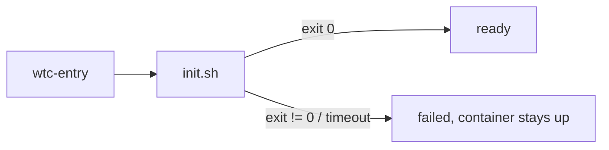

# Authoring a wtc setup

A setup is a directory describing how to build and initialise one container per git worktree. Start from [examples/setup-basic](../examples/setup-basic); design rationale lives in [the spec](superpowers/specs/2026-09-30-wtc-design.md).

## Layout

- [wtc.setup.ts](../examples/setup-basic/wtc.setup.ts): `export default defineSetup({...})`; `defineSetup` is imported from `"wtc"` (virtual module served by the CLI, [packages/cli/src/main.ts](../packages/cli/src/main.ts)).
- Manifest fields, defaults and validation: [packages/lib/src/setup/schema.ts](../packages/lib/src/setup/schema.ts) (the only field reference).
- [image/Dockerfile](../examples/setup-basic/image/Dockerfile): default build context. Editing `init.sh` / `scripts/` never rebuilds the image (they are mounted read-only at `/wtc/setup`).
- [init.sh](../examples/setup-basic/init.sh) and [scripts/](../examples/setup-basic/scripts/restart-dev-server.sh): container-side logic.
- `.wtc/` (gitignored): host-side run state and logs.
- Relative `bind` mount sources resolve against the setup dir; `~` expands to `$HOME`.

## init.sh contract

Runs on every container boot (including VM/colima restarts, `wtc restart`). Implementation: [kit/bin/wtc-entry](../kit/bin/wtc-entry).

- **Idempotent**: guard clone/copy steps (see the `[ ! -d ... ]` check in the example).
- **Must exit.** Exit code `0` = `ready`, non-zero = `failed`; exceeding `readyTimeout` also fails it. There is no separate ready signal.
- **Progress**: `wtc-signal phase <name> [msg]` ([kit/bin/wtc-signal](../kit/bin/wtc-signal)). Conventional names: `clone`, `install`, `start`.
- **Install**: `wtc-install [-C dir] [pnpm args]` ([kit/bin/wtc-install](../kit/bin/wtc-install)). Signals `install`, takes a shared lock on the pnpm store, runs `pnpm install --frozen-lockfile --prefer-offline`.
- **Long-running services** (dev servers): start detached in tmux, wait for them to be healthy, then exit. See [restart-dev-server.sh](../examples/setup-basic/scripts/restart-dev-server.sh).
- Output is teed to `.wtc/log/<name>/init.<bootId>.log` (`wtc logs`).
- A failed init leaves the container running for `wtc shell`; `wtc restart` reruns it.

## Image requirements

- Needed: bash, git, openssh-client, `flock` (util-linux), node >= 22, pnpm >= 11. Recommended: tmux, curl (for `checks`).
- No socat/jq needed; port forwarding, SOCKS and status JSON come from `wtc-kit`.
- The image `ENTRYPOINT`/`CMD` are ignored; wtc overrides the entrypoint with `wtc-entry`.
- `wtc doctor` verifies the toolchain ([packages/lib/src/ops/doctor.ts](../packages/lib/src/ops/doctor.ts)).

## pnpm gotchas

- **`allowBuilds`**: pnpm 11 fails on ignored build scripts (`ERR_PNPM_IGNORED_BUILDS`). Declare `allowBuilds` in the repo's `pnpm-workspace.yaml` (example: [fixture-app/pnpm-workspace.yaml](../examples/setup-basic/fixture-app/pnpm-workspace.yaml)).
- **Missing `pnpm-lock.yaml`**: `wtc-install` uses `--frozen-lockfile`, which fails without a committed lockfile. Pass `wtc-install -C <repo> --no-frozen-lockfile`.
- **`shamefullyHoist: true` repos**: run commands via `pnpm run`, `pnpm exec` or `pnpx`. These rewrite `NODE_PATH` and related settings; plain `node x.js` may fail to resolve modules. Applies to `init.sh`, `scripts`, `checks` and tmux commands.
- **Files needed inside a cloned repo** (configs, env files): mount them to a side path and **copy** them in. Do not symlink; Node resolves `require` from the symlink's real path outside the repo.

## Host / platform notes

- **colima shares only `$HOME`**: the setup dir and every `bind` source must live under it (else `BIND_NOT_SHARED`); `/tmp` and `/private/tmp` mount as empty dirs.
- **Private git over ssh**: private keys never enter the container; the host ssh-agent is forwarded to `/wtc/ssh-agent.sock`.
  - colima needs `forwardAgent: true` in `~/.colima/default/colima.yaml` (`wtc doctor` checks it).
  - List git hosts in `ssh.knownHosts`; entries are copied from the host's `~/.ssh/known_hosts`. A missing entry is a warning and the host is skipped: `ssh` to it once on the host first.
  - Alternative without an agent: `bind` a key file read-only to a side path, copy it to `~/.ssh` with mode 600 in `init.sh`, and set `GIT_SSH_COMMAND="ssh -i <key> -o IdentitiesOnly=yes"`.
- **Params** are injected as plain env vars: do not put secrets there.
- **`hostForwards`**: container `127.0.0.1:
` reaches host `
`. On Linux the host service must listen on docker0 or `0.0.0.0`.

## SOCKS exposure

- `socksBind` defaults to `0.0.0.0`: **anyone on the LAN** can reach every `127.0.0.1` service in the container and, through it, the host (`host.docker.internal`) and the container's networks.
- Restrict with `socksBind: "127.0.0.1"` or require credentials with `socksAuth: { user, pass }` (plain text in the manifest; also passed as env to the container).
- Both are creation-time settings: change requires `wtc rm` and `up`.
- Clients must use `socks5h://` and drop `localhost` from `NO_PROXY` (`wtc tunnel` prints hints).
- On macOS the firewall must allow `limactl` for LAN access.

## See also

- Agent usage of the CLI: [packages/cli/skill/SKILL.md](../packages/cli/skill/SKILL.md)
- Running the example end to end: [README.md](../README.md), [DEVELOPMENT.md](../DEVELOPMENT.md)
