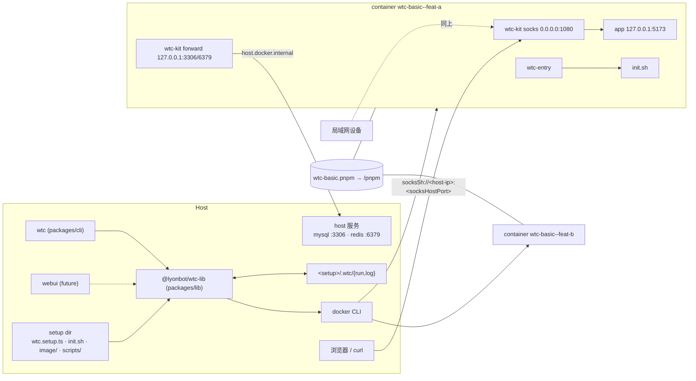
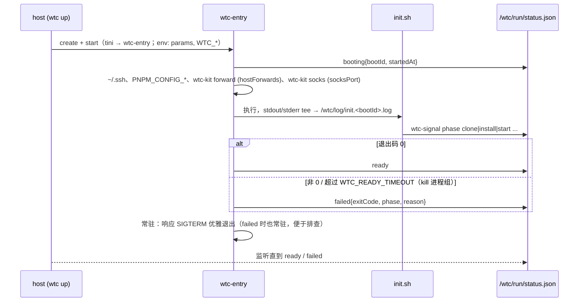
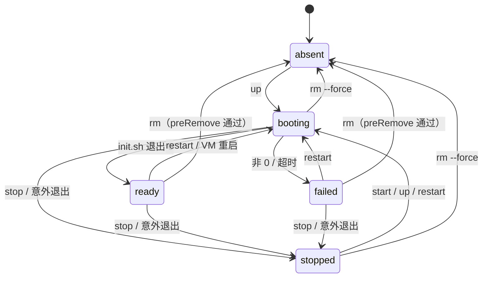
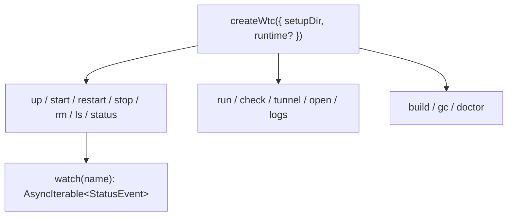

# wtc (worktree container) — 设计文档

- **日期**：2026-09-30
- **状态**：Draft，待评审
- **范围**：v1 = `@lyonbot/wtc-lib` + `@lyonbot/wtc-cli` + `kit/` + `examples/setup-basic` + 文档交付物（§15）；webui 仅预留接口

## 1. 目标与价值

- **一个 worktree = 一个长期存在的容器**，靠容器 network namespace 让多个 worktree 同时使用相同端口（5173、8080……）而不冲突。
- **加速安装**：同一 setup 的所有容器共享一个 pnpm store volume，配合 global virtual store，热 store 下 `pnpm install --frozen-lockfile --prefer-offline` 亚秒级（实测 0.37s）。
- **项目差异由 setup 目录描述**，wtc 本身只提供生命周期、通信协议与约定。

**成功标准**

- `wtc up feat-a --set REPO_A_BRANCH=feat-x` 创建隔离容器并阻塞到 `ready` / `failed`，实时显示阶段。
- `wtc run feat-a restart-dev-server` 执行 manifest 声明的脚本。
- 宿主机及局域网内其他设备（手机、测试机）经 `wtc tunnel feat-a` 给出的 SOCKS5 地址，访问容器内仅监听 `127.0.0.1:5173` 的服务；地址在实例生命周期内固定。
- 容器内以 `127.0.0.1:3306` 访问宿主机上的 MySQL（`hostForwards`）。
- `stop` / `start` 保留代码与 node_modules；`rm` 受 `preRemove` 保护。

**非目标（v1）**：远程/集群调度、webui 实现、PAC 生成、Windows。

**不支持 apple/container**：其 named volume 为独占 ext4 镜像，无法同时挂给多个容器（第二个容器启动报 `VZErrorDomain Code=2`）；改用 virtiofs bind mount 时两 VM 并发冷装会让 `store/v11/index.db` 永久损坏（`database disk image is malformed`）。共享 store 是核心价值，故放弃。

## 2. 目标平台

| 平台 | v1 | 说明 |
|---|---|---|
| Linux + docker | ✅ 主要 | |
| macOS + colima (docker) | ✅ 主要 | 容器 IP 宿主机不可达 → 端口发布 |
| Docker Desktop / OrbStack | 未专门测试 | 同一 docker adapter，理论可用 |

平台差异（由 `runtime/docker-cli.ts` 探测处理，业务层不感知）：

| 差异点 | Linux | colima |
|---|---|---|
| SSH agent 来源 | `$SSH_AUTH_SOCK` | VM 内 `/run/host-services/ssh-auth.sock`（需 `forwardAgent: true`） |
| `host.docker.internal` | 需 `--add-host=host.docker.internal:host-gateway`；宿主机服务须监听 docker0 或 `0.0.0.0`，仅监听 `127.0.0.1` 不可达 | 默认可解析（→ `192.168.5.2`），宿主机仅监听 `127.0.0.1` 的服务也可达（已验证） |
| 可 bind 的宿主机路径 | 任意 | 仅 colima 已挂载目录（默认 `$HOME`）；其他路径（如 `/private/tmp`）会被静默挂成空目录（已验证） |

## 3. 架构



- **forward（`hostForwards`）**：入方向。把宿主机上的常用端口带进容器，容器内代码按 `127.0.0.1:<port>` 访问即可，无需改配置。
- **socks（`socksPort`）**：出方向。把容器内所有 `LISTEN 127.0.0.1:*` 的服务以一个 SOCKS5 代理暴露给宿主机（默认绑定 `0.0.0.0`，局域网设备也可使用），不需要逐个发布端口。

### 3.1 仓库布局（规划）

| 路径 | 职责 |
|---|---|
| `packages/lib/src/runtime/` | `Runtime` 接口；`docker-cli.ts` 实现（含 §2 平台差异）；测试用 `FakeRuntime` |
| `packages/lib/src/setup/` | 加载 `wtc.setup.ts`，zod 校验，`defineSetup()` 导出 |
| `packages/lib/src/instance/` | 生命周期 up/start/restart/stop/rm/ls，状态合并 |
| `packages/lib/src/status/` | 读取/监听 `.wtc/run/<name>/status.json` |
| `packages/lib/src/health/`、`packages/lib/src/ops/` | health 聚合；build / exec(run·check·shell) / logs / tunnel / open / gc / doctor |
| `packages/cli/` | 参数解析 + 渲染，零业务逻辑；bin 名 `wtc` |
| `kit/` | 挂载到容器 `/wtc/bin`：bash 脚本 `wtc-entry`、`wtc-signal`、`wtc-install`，以及 Go 静态二进制 `wtc-kit`（linux/amd64+arm64；子命令 `socks`、`forward`、`status`） |
| `examples/setup-basic/` | 参考 setup，兼作集成测试 fixture |
| `packages/cli/skill/SKILL.md` | 面向 agent 的 CLI 使用说明（§15） |
| `docs/authoring-setup.md` | setup 编写指南（§15） |

- **技术栈**：Bun + TypeScript monorepo（bun workspaces）；分发用 `bun build --compile`。
- **kit 分发**：kit 嵌入 CLI 二进制，首次运行时解压到 `~/.cache/wtc/kit/<version>-<arch>-<contenthash>/`（`WTC_CACHE_DIR` 可改根目录）后只读挂载。路径带版本、架构与内容哈希，升级 wtc 不影响运行中的容器。
- **为什么 host 侧不是 Go**：manifest 需要 TS（类型 + 逻辑），未来 webui 要共享类型；runtime 走 CLI，Go SDK 的优势用不上。
- **为什么容器内用 Go `wtc-kit`**：静态 socat 难以构建，microsocks 需要按架构编 C；Go 交叉编译一个二进制就能替代 socat / microsocks / jq，镜像零额外依赖。

### 3.2 Runtime 适配层

- **走 docker CLI 而非 Engine API**：不用处理 colima / Docker Desktop 的 socket 发现，行为与用户手敲命令一致。实现为 `Bun.spawn` + `--format json` 解析；交互式命令（`shell`）直接 `exec` 透传 TTY。
- **接口动词（仅所需）**：`build`、`create`、`start`、`stop`、`restart`、`rm`、`exec`、`inspect`、`ps(labels)`、`logs`、`port`、`volumeCreate/Rm/Ls`、`imageLs/Rm`。
- **create 固定参数**：`--init`（tini 作 PID 1，负责回收僵尸进程、转发信号；已验证 `wtc-entry` 为其子进程）、`--restart unless-stopped`、`-p <socksBind>:<socksHostPort>:<socksPort>`、labels。

## 4. 命名与标识

- **id 规则**：setupId / name / volume 名均须匹配 `^[a-z0-9]+(-[a-z0-9]+)*$`，即不含 `--`、`.`、`_`。这样下面的分隔符不会产生歧义。
- `--` 分隔 setup 与实例，`.` 分隔资源类别：

| 资源 | 名称 |
|---|---|
| 容器 | `wtc-<setupId>--<name>` |
| 镜像 | `wtc-<setupId>:<imageHash>` |
| pnpm store volume | `wtc-<setupId>.pnpm` |
| 自定义 volume（`scope: setup`） | `wtc-<setupId>.v.<vol>` |
| 自定义 volume（`scope: instance`） | `wtc-<setupId>--<name>.v.<vol>` |

- **imageHash** = hash(build context 内文件 + dockerfile + buildArgs)。`init.sh` 与 `scripts/` 不在 context 内，改动它们不影响 hash。
- **labels**：`wtc.setup`、`wtc.setupDir`（绝对路径）、`wtc.name`、`wtc.protocol`（kit 与 status 协议版本）、`wtc.socksHostPort`，volume 另加 `wtc.scope`。
- **setupId 冲突**：同名 setupId 已有资源但 `wtc.setupDir` 不同 → 报错，不操作。
- **事实来源**：实例列表以 `ps --filter label=wtc.setup=<id>` 为准；`.wtc/run/<name>/` 只是辅助记录，两者不一致时以 runtime 为准。

## 5. Setup 目录与 manifest

`wtc.setup.ts` 中 `import { defineSetup } from "wtc"`：`wtc` 是 CLI 注册的虚拟模块（`bun` 与编译产物均可用，`@lyonbot/wtc-lib` 同理，见 `packages/cli/src/main.ts`）；暂无编辑器类型提示，直接 `export default {...}` 亦可。

```
setups/basic/
├── wtc.setup.ts          # export default defineSetup({...})
├── init.sh               # 项目初始化：clone、install、起服务；必须幂等、必须退出
├── image/                # 默认 build context
│   └── Dockerfile
├── scripts/              # 暴露给 `wtc run`，容器内路径 /wtc/setup/scripts/*
└── .wtc/                 # gitignore
    ├── run/<name>/       # status.json · create.json
    └── log/<name>/       # init.<bootId>.log
```

### 5.1 manifest 字段

| 字段 | 说明 |
|---|---|
| `id` | setupId |
| `image` | `{ context?, dockerfile?, buildArgs? }`，默认 `context: "image"` |
| `init` | 初始化脚本路径，默认 `init.sh` |
| `params` | `{ KEY: { description, default?, required?, pattern? } }`，原样作为 env 注入（明文，不适合放密钥）；webui 据此渲染表单 |
| `cwd` | shell / run / open 的默认目录，默认 `/workspace`（同时是 `wtc-install` 的默认安装目录） |
| `scripts` | `{ name: { run, description } }` |
| `checks` | `{ name: { run, timeout? } }`，多个子项聚合为整体 health |
| `hostForwards` | `number[]`，如 `[3306, 6379]`：容器内 `wtc-kit forward` 监听 `127.0.0.1:<p>` → `host.docker.internal:<p>` |
| `socksPort` | `wtc-kit socks` 在容器内的监听端口，默认 `1080`；不得出现在 `hostForwards` 中 |
| `socksBind` | 宿主机侧绑定地址，默认 `0.0.0.0`（局域网可访问）；设为 `127.0.0.1` 则仅本机可用 |
| `socksAuth` | 可选 `{ user, pass }`，启用 SOCKS5 用户名密码认证 |
| `socksHostPortRange` | 宿主机端口分配区间，默认 `[21080, 21179]`，见 §10 |
| `mounts` | 自定义挂载，见 §5.2 |
| `preRemove` | rm 前检查脚本，非 0 拒绝 |
| `readyTimeout` | init.sh 最长运行时间，默认 15min |
| `ssh` | `{ knownHosts?: string[] }` 需要信任的 git 主机，见 §6.4 |

### 5.2 自定义 mounts

```ts
mounts: [
  { type: "volume", name: "m2", target: "/root/.m2",   scope: "setup" },
  { type: "volume", name: "pg", target: "/var/lib/pg", scope: "instance" },
  { type: "volume", external: "shared-models", target: "/models", readonly: true },
  { type: "bind",   source: "~/datasets", target: "/data", readonly: true },
]
```

- `setup` 级：同 setup 的实例共享，`rm` 不删；`instance` 级：随 `wtc rm` 删除；`external`：wtc 既不创建也不删除。
- **校验**：target 不得与 `/wtc/*`、`/pnpm` 冲突；bind source 展开 `~`、相对路径按 **setup 目录**解析，随后校验存在，在 colima 上还须位于已挂载目录内。

### 5.3 pnpm store 策略

- 注入方式：`wtc-entry` 设置 `PNPM_CONFIG_STORE_DIR=/pnpm/store`、`PNPM_CONFIG_CACHE_DIR=/pnpm/cache`，并按 pnpm 版本二选一：≥ v11.23 用 `PNPM_CONFIG_VIRTUAL_STORE_TYPE=global`，否则用 `PNPM_CONFIG_ENABLE_GLOBAL_VIRTUAL_STORE=true`（实测 11.28.2 生效）。
- repo 放在容器 overlayfs（放 volume 没有收益，已验证）。
- docker/colima 上 named volume 并发冷装 3 轮均正常，因此并发安装本身不加锁。只有 GC 需要和安装互斥，见 §11。

## 6. 容器内约定

### 6.1 挂载

| 容器路径 | 来源 | 模式 |
|---|---|---|
| `/pnpm` | `wtc-<setupId>.pnpm` | rw |
| `/wtc/bin` | `~/.cache/wtc/kit/<version>-<arch>-<contenthash>/` | ro |
| `/wtc/setup` | setup 目录（改 init.sh / scripts 无需重建镜像） | ro |
| `/wtc/ssh` | `.wtc/run/<name>/ssh/`（wtc 生成的 `config`、`known_hosts`） | ro |
| `/wtc/ssh-agent.sock` | 宿主机 / VM 的 agent socket（§2）；按 `-v` 语义挂载，源缺失时容忍（docker 自动创建空目录），`wtc-entry` 仅在其为 socket 时设置 `SSH_AUTH_SOCK` | rw |
| `/wtc/run` | `.wtc/run/<name>/` | rw |
| `/wtc/log` | `.wtc/log/<name>/` | rw |

### 6.2 镜像约定（`wtc doctor` 可检查）

- 预装：bash、git、openssh-client、`flock`（util-linux）、node ≥ 22、pnpm ≥ 11；tmux 为推荐项。
- 端口转发、SOCKS5、status JSON 读写均由 kit 的 `wtc-kit` 提供，镜像不必安装 socat / jq。
- entrypoint 被覆盖为 `/wtc/bin/wtc-entry`，镜像自身的 `ENTRYPOINT` / `CMD` 不生效。

### 6.3 Repo 侧约定

- init.sh 用 `wtc-install` 安装依赖。它会先发 `phase install`，再持共享锁执行 `pnpm install --frozen-lockfile --prefer-offline`；额外参数透传给 pnpm（`-C <dir>` 指定目录，无 lockfile 的 repo 加 `--no-frozen-lockfile`）。
- pnpm 11 默认对被忽略的 build script 报错（`ERR_PNPM_IGNORED_BUILDS`）→ repo 须在 `pnpm-workspace.yaml` 声明 `allowBuilds`。
- repo 若使用 `shamefullyHoist: true`，命令须经 `pnpm run` / `pnpm exec` / `pnpx` 执行（它们会改写 `NODE_PATH` 等配置），直接 `node xxx` 可能找不到模块。wtc 不干预，只在 setup 编写指南（§15）中说明。
- GC 由 host 负责，容器内不执行 prune。

### 6.4 SSH / git

- 私钥不进容器；agent socket 存在时 `SSH_AUTH_SOCK=/wtc/ssh-agent.sock`。
- `wtc-entry` 把 `/wtc/ssh/{config,known_hosts}` **复制**到 `~/.ssh`（可写，避免 ssh 写 known_hosts 失败）；clone 完全由 init.sh 负责。
- **known_hosts 来源**：`wtc up` 时从宿主机 `~/.ssh/known_hosts` 按 `ssh.knownHosts` 用 `ssh-keygen -F` 提取。只沿用宿主机已信任的公钥，不在容器里首次信任；缺失时**警告并跳过**该主机（不报错；`up` 事件流输出 `warning:`），提示先在宿主机上 ssh 一次。
- colima 须开启 `forwardAgent: true`，`doctor` 检查此项。

## 7. 启动流程与 status 协议



- **init.sh 必须退出**：长驻服务（dev server 等）须后台启动（推荐 tmux）。是否 ready 由退出码决定，没有单独的 `ready` 信号。脚本需要等服务就绪时，自己在退出前等待。
- **`wtc-signal phase <name> [msg]`**：原子写（tmp + rename）status.json，同时向 stdout 打印一行。只有 `booting` 状态下有效。
- **超时由 entry 负责**：这样 `--no-wait` 与 webui 的行为一致。
- **status.json**：`{ bootId, startedAt, state: "booting"|"ready"|"failed", phase, message?, exitCode?, reason?: "exit"|"timeout", history: [...] }`。
- **约定阶段名**：`bootstrap`、`clone`、`install`、`start`（可扩展）。
- **防陈旧**：`status.startedAt < inspect.State.StartedAt` 时视为 `booting（尚无信号）`。两个时间都来自 daemon 所在机器（colima 下即 VM）的时钟，不受宿主机时钟偏差影响。
- **注入 env**：`WTC_SETUP_ID`、`WTC_NAME`、`WTC_CWD`、`WTC_INIT`、`WTC_READY_TIMEOUT`、`WTC_SOCKS_PORT`、`WTC_SOCKS_USER` / `WTC_SOCKS_PASS`（配置 socksAuth 时）、`WTC_HOST_FORWARDS`（逗号分隔）。

## 8. 实例状态机



- 状态 = runtime 容器状态 × status.json（按 §7 防陈旧规则对齐）。
- `--restart unless-stopped`：colima 或 VM 重启后容器自动启动并重跑 init.sh（init.sh 须幂等）；手动 `stop` 的实例不会自动启动。
- `preRemove` 需在运行中的容器内 `exec`：`stopped` 或 `booting` 状态下，不带 `--force` 的 `rm` 会被拒绝。`--force` 在任何状态下都跳过 preRemove。
- **health** 是独立维度，只在 `ready` 下有意义：`healthy` / `degraded` / `unhealthy` / `unknown`；通过 `exec` 执行 `checks` 聚合得出。

## 9. CLI

setup 解析顺序：`--setup <dir>` → `WTC_SETUP` → 从 cwd 向上查找 `wtc.setup.ts`。查询类命令都支持 `--json`。

| 命令 | 作用 |
|---|---|
| `wtc build` | 构建镜像，hash 未变则跳过 |
| `wtc up <name> [--set K=V]… [--socks-bind <addr>] [--socks-host-port <p>] [--no-wait]` | absent → 创建；stopped → 启动；booting → 等待；ready → 直接返回；failed → 非 0 退出并提示 `restart` |
| `wtc start` / `stop` / `restart <name>` | stop/start 保留 overlay；restart 重跑 init.sh |
| `wtc rm <name> [--force]` | 按 §8 执行 `preRemove`；删除容器、instance 级 volume 与 run/log 目录 |
| `wtc ls` / `status <name> [--watch]` | state、phase、health、socks 地址、stale-image 标记 |
| `wtc logs <name> [-f] [--boot <id>]` | 读取 `.wtc/log/<name>/` |
| `wtc run <name> <script> [-- args]` | 执行 manifest scripts，cwd = manifest `cwd` |
| `wtc check <name>` | 立即执行 checks 并逐项输出 |
| `wtc shell <name>` | 交互式 exec，进入 manifest `cwd` |
| `wtc tunnel <name>` | 输出本机 `socks5h://127.0.0.1:<port>`；`socksBind` 为 `0.0.0.0` 时另列各局域网 IP 地址；附 NO_PROXY 提示 |
| `wtc open <name> [code\|cursor]` | `--folder-uri vscode-remote://attached-container+<hex>/<cwd>`；默认编辑器可在 `~/.config/wtc/config.json` 配置；编辑器不在 PATH 时输出 URI |
| `wtc gc [--dry-run] [--prune-store]` | 见 §11 |
| `wtc skill [--llms]` | 打印内嵌的 agent 使用说明（§15） |
| `wtc doctor` | runtime/daemon、colima `forwardAgent` 与挂载目录、macOS 防火墙是否放行 `limactl`、镜像工具链、`allowBuilds` 提示 |

## 10. 网络与隧道

- **出方向（host / 局域网 → 容器）**：创建时 `-p <socksBind>:<socksHostPort>:<socksPort>`。
  - **固定宿主机端口**：若让 docker 随机分配（`-p <bind>::<port>`），端口每次 start / restart 都会变（已验证），局域网设备里配置的代理就失效了。因此由 wtc 在 create 时分配固定端口；显式端口在 restart、stop/start 后保持不变（已验证）。
  - **分配**：取 `socksHostPortRange` 中第一个满足条件的端口：既不在任何 wtc 容器（跨 setup）的 `wtc.socksHostPort` label 中，宿主机上也未被监听。`--socks-host-port` 可手动指定。端口写入 label 与 `create.json`。
  - **冲突**：docker 在 start 时才绑定端口，create 阶段不报错（已验证）。首次 `up` 时 start 报端口占用 → 删除容器，换下一个端口重试（顺带解决并发 `up` 不同实例时的竞争）。已有实例 start 时端口被其他进程占用 → 报错，提示释放端口或 `rm` 重建。
  - `socksBind` / 端口是创建时参数，修改需 `rm` 重建。
- **入方向（容器 → host）**：`wtc-kit forward` 按 `hostForwards` 监听容器内 `127.0.0.1:<p>`，转发到 `host.docker.internal:<p>`；平台前提见 §2。
- **NO_PROXY 陷阱**：宿主机上常见 `NO_PROXY=localhost,127.0.0.1`，它会让 curl/浏览器绕过 SOCKS，直连宿主机上的同端口服务（已复现）。`wtc tunnel` 输出须提示使用 `socks5h://` 并去掉 localhost 绕过。
- **局域网访问（colima）**：lima 的 grpc 端口转发会在 macOS 上监听 `*:<port>`，局域网可达（已验证）。前提是 macOS 防火墙放行 `limactl`；brew 升级 lima 后二进制路径会变，需要重新放行。
- **安全边界**：未配置 `socksAuth` 时 SOCKS 无鉴权。默认 `0.0.0.0` 时，**局域网内任何人**都能经它访问容器内所有 `127.0.0.1` 服务，并借容器访问宿主机（`host.docker.internal`，colima 下包括宿主机上仅监听 `127.0.0.1` 的服务）以及容器能访问的任何网络，相当于一个开放代理。在不可信网络中应设 `socksBind: "127.0.0.1"` 或配置 `socksAuth`。同一 docker 网络中的其他容器也能直接连它。
- 已验证链路（colima）：host `curl --socks5-hostname 127.0.0.1:<port>` → 发布端口 → 容器内 SOCKS5 → 容器内 `127.0.0.1:5173` ✅；局域网 IP 访问 `0.0.0.0` 发布端口 ✅。

## 11. GC（host 负责）

- **默认清理**：无对应容器的 `.wtc/{run,log}/<name>/`；带 wtc labels 但无容器的 instance 级 volume；非当前 hash 且无容器引用的镜像 tag；现存实例中不属于当前 boot 的旧 `init.*.log`（保留最近 N 个）。
- **`--prune-store`（显式开启）**：用临时容器挂载 `wtc-<setupId>.pnpm`，在 `flock -x /pnpm/.wtc-lock` 下执行 `pnpm store prune`，与 `wtc-install` 的共享锁互斥（所有容器同属一个内核，跨容器 flock 已验证有效）。
- **pnpm 11.28.2 实测行为**：
  - store 的 `projects/` 按项目路径登记。各实例的容器内路径相同，所以所有实例只有一条登记，无法按实例追踪引用。
  - `store prune` 只会清掉失效的项目登记和元数据缓存，**不回收 GVS `links/`**：从临时容器、从实例内，或在无人引用某个包时执行，都是 `Removed 0 packages`。
  - 因此 prune 不会误删运行中或已停止实例的依赖（已验证），但几乎回收不了空间；这也是它不默认开启的原因。
- **空间回收**：v1 不做。store 过大时，由用户在 `rm` 掉全部实例后手动删除 volume。

## 12. 错误处理

| 场景 | 行为 |
|---|---|
| init.sh 失败 / 超时 | entry 写 `failed` 后常驻；用户 `shell` 排查，`restart` 重跑 |
| `up` 等待中收到失败 | 打印最后 50 行日志，非 0 退出，不删除容器 |
| `--set` 与 `create.json` 不一致 | 只比较显式传入的键；不一致则报错，提示须 `rm` 重建（params 是创建时注入的 env） |
| 镜像 hash 变化 | `ls`/`status` 标记 `stale-image`，不自动重建 |
| host 并发 `up` 同名 | 以 runtime 容器名唯一性作锁，后到者转为等待已有实例 |
| socks 宿主机端口被占用 | 首次 up：换端口重试；已有实例：报错，提示释放端口或 `rm` 重建（§10） |
| setupId 与其他 setup 目录冲突 | 报错（§4） |
| runtime 不可用 | 提示运行 `wtc doctor` |

## 13. lib 接口



- 长操作（`up`、`logs -f`、`status --watch`）返回 `AsyncIterable` 事件流：CLI 用来渲染进度，webui 可直接转成 SSE。

## 14. 测试

| 层级 | 内容 | 依赖 |
|---|---|---|
| 单元（`bun test`） | manifest 校验、id 与命名、socks 端口分配、mount 冲突、状态合并（runtime × status × startedAt）、`create.json` diff、imageHash 范围 | `FakeRuntime` |
| kit | `wtc-signal` 原子写、`wtc-entry` 退出码/超时 → failed、pnpm 版本分支、`wtc-install` 锁 | 临时目录 + bash |
| 集成（需 docker） | `examples/setup-basic`：up → ready → run → check → tunnel 访问容器内 127.0.0.1 服务 → hostForwards 访问宿主机服务 → stop/start 后 socks 端口不变 → 端口冲突重试 → restart（幂等）→ rm（preRemove 拦截）；共享 store 并发冷装；NO_PROXY 场景；`--prune-store` 引用安全性 | 本机 colima；CI 用 Linux docker |

## 15. 文档交付物

| 交付物 | 读者 | 内容 |
|---|---|---|
| `packages/cli/skill/SKILL.md` | 其他项目中的 agent（Claude Code skill / llms.txt） | 何时使用 wtc、命令速查、典型流程（up → tunnel → run → rm）、`--json` 输出约定、常见错误与处理 |
| `wtc skill` 命令 | 同上 | 打印内嵌的 SKILL.md（`--llms` 输出去掉 frontmatter 的 llms.txt 形式），便于 `wtc skill > .claude/skills/wtc/SKILL.md` 安装 |
| `docs/authoring-setup.md` | setup 作者 | manifest 字段、init.sh 约定（幂等、必须退出、`wtc-signal`/`wtc-install`）、镜像要求、shamefullyHoist 须经 `pnpm run`/`exec`/`pnpx`、socks 安全提示 |

- SKILL.md 的命令与参数须与 `packages/cli` 保持一致，由测试校验（每个 `wtc <cmd> --help` 中的命令都须在 SKILL.md 中出现）。

## 16. Future work

- webui：基于 lib 事件流 + SSE；PAC / SwitchyOmega 配置生成。
- 将 kit 中的 bash 脚本（entry / signal / install）也并入 `wtc-kit`。
- GVS store 空间回收：需要 pnpm 支持回收 `links/`，或由 wtc 基于各实例 lockfile 自行计算引用集。
