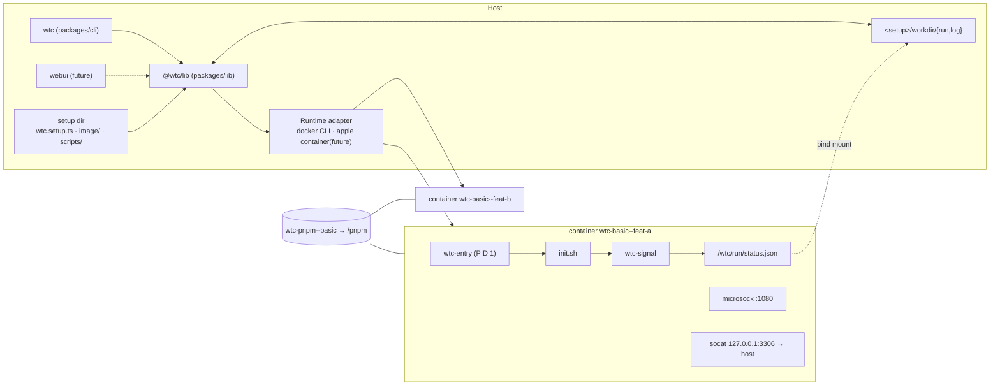
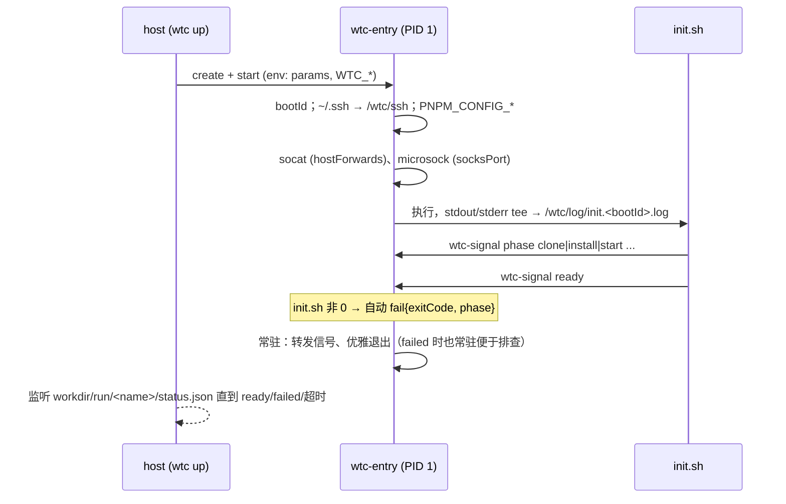
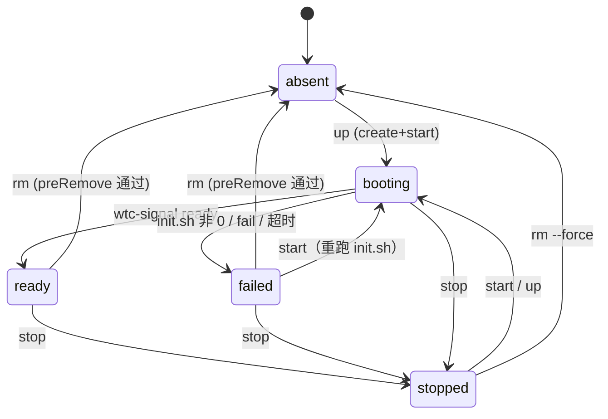
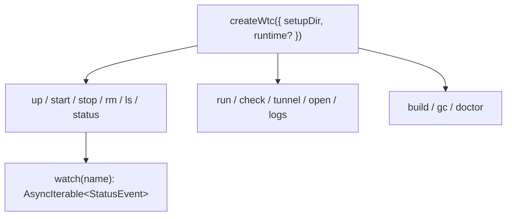

# wtc (worktree container) — 设计文档

- **日期**：2026-09-30
- **状态**：Draft，待评审
- **范围**：v1 = `@wtc/lib` + `@wtc/cli` + `kit/` + `examples/setup-basic`；webui / apple container adapter 仅预留接口

## 1. 目标与价值

- **一个 worktree = 一个长期存在的容器**，靠容器 network namespace 让多个 worktree 同时使用相同端口（5173、8080……）而不冲突。
- **加速安装**：同一 setup 的所有容器共享一个 pnpm store volume，配合 global virtual store，热 store 下 `pnpm install --frozen-lockfile --prefer-offline` 亚秒级（实测 0.37s）。
- **项目差异由 setup 目录描述**，wtc 本身只提供生命周期、通信协议与约定。

**成功标准**

- `wtc up feat-a --set REPO_A_BRANCH=feat-x` 创建隔离容器并阻塞到 `ready` / `failed`，实时显示阶段。
- `wtc run feat-a restart-dev-server` 执行 manifest 声明的脚本。
- 宿主机经 `wtc tunnel feat-a` 给出的 SOCKS5 地址访问容器内仅监听 `127.0.0.1:5173` 的服务。
- `stop` / `start` 保留代码与 node_modules；`rm` 受 `preRemove` 保护。

**非目标（v1）**：远程/集群调度、webui 实现、apple container adapter、PAC 生成、跨 VM 串行化安装锁。

## 2. 目标平台

| 平台 | v1 | 说明 |
|---|---|---|
| Linux + docker | ✅ 主要 | |
| macOS + colima (docker) | ✅ 主要 | 容器 IP 宿主机不可达 → 端口发布 |
| macOS + apple/container | ⏳ 预留 | CLI 与 docker 近似；volume 独占 → 见 §5.3 |
| Docker Desktop / OrbStack | 未专门测试 | 按 docker adapter 走，理论可用 |

## 3. 架构



### 3.1 仓库布局（规划）

| 路径 | 职责 |
|---|---|
| `packages/lib/src/runtime/` | `Runtime` 接口 + capabilities；`docker-cli.ts` 实现 |
| `packages/lib/src/setup/` | 加载 `wtc.setup.ts`，zod 校验，`defineSetup()` 导出 |
| `packages/lib/src/instance/` | 生命周期 up/start/stop/rm/ls，状态合并 |
| `packages/lib/src/status/` | 读取/监听 `workdir/run/<name>/status.json` |
| `packages/lib/src/{health,scripts,tunnel,open,gc,doctor}/` | 各子功能 |
| `packages/cli/` | 参数解析 + 渲染，零业务逻辑；bin 名 `wtc` |
| `kit/` | 挂载到容器 `/wtc/bin`：`wtc-entry`、`wtc-signal`、pnpm env、NODE_PATH/ESM resolve hook |
| `examples/setup-basic/` | 参考 setup，兼作集成测试 fixture |

- **技术栈**：Bun + TypeScript monorepo（bun workspaces）；分发用 `bun build --compile`。
- **为什么不是 Go**：manifest 需要 TS（类型 + 逻辑）、未来 webui 共享类型；runtime 走 CLI 使 Go SDK 优势无效。容器内 kit 若变复杂，可单独用 Go 写静态 `wtc-agent`，仅通过 `/wtc` 与 status 协议与 host 交互（future）。

### 3.2 Runtime 适配层

- **走 CLI 而非 Engine API**：为兼容 docker 与 apple/container 等“docker 形状”的 CLI。实现为 `Bun.spawn` + `--format json` 解析；交互式命令（`shell`）直接 `exec` 透传 TTY。
- **接口动词（仅所需）**：`build`、`create`、`start`、`stop`、`rm`、`exec`、`inspect`、`ps(labels)`、`logs`、`port`、`volumeCreate/Rm/Ls`。
- **capabilities**（lib 据此选策略，不在业务层判断 runtime 类型）：

| capability | docker | apple/container |
|---|---|---|
| `network` | `publish`：创建时 `-p 127.0.0.1::<socksPort>` | `direct-ip`：`<container-ip>:<socksPort>` |
| `sharedVolume` | `concurrent` | `exclusive` |
| `sshAgent` | 挂载 socket：Linux `$SSH_AUTH_SOCK`；colima `/run/host-services/ssh-auth.sock` | `--ssh`（容器内 `/var/host-services/ssh-auth.sock`） |
| `hostGateway` | Linux 需 `--add-host=host.docker.internal:host-gateway`；colima 默认可解析 | 待验证 |

## 4. 命名与标识

- 分隔符统一用 `--`（setupId / name 本身可含 `-`）。
- 容器：`wtc-<setupId>--<name>`；镜像：`wtc-<setupId>:<hash(image/)>`。
- pnpm volume：`wtc-pnpm--<setupId>`（`exclusive` runtime：`wtc-pnpm--<setupId>--<name>`）。
- 自定义 volume：`scope: setup` → `wtc-<vol>--<setupId>`；`scope: instance` → `wtc-<vol>--<setupId>--<name>`。
- labels：`wtc.setup`、`wtc.name`、`wtc.version`、`wtc.scope`（volume）。
- **事实来源**：实例列表以 runtime `ps --filter label=wtc.setup=<id>` 为准；`workdir/run/<name>/` 为辅助记录，不一致时以 runtime 为准。

## 5. Setup 目录与 manifest

```
setups/basic/
├── wtc.setup.ts          # export default defineSetup({...})
├── image/
│   ├── Dockerfile
│   └── init.sh           # 项目初始化：clone、install、起服务；必须幂等
├── scripts/              # 暴露给 `wtc run`，容器内路径 /wtc/setup/scripts/*
└── workdir/              # gitignore
    ├── run/<name>/       # status.json · create.json · tunnel.json
    └── log/<name>/       # init.<bootId>.log
```

### 5.1 manifest 字段

| 字段 | 说明 |
|---|---|
| `id` | setupId |
| `image` | `{ context, dockerfile, buildArgs? }` |
| `params` | `{ KEY: { description, default?, required?, pattern? } }`，原样作为 env 注入；webui 据此渲染表单 |
| `workdir` | shell / run / open 的默认目录 |
| `scripts` | `{ name: { run, description } }` |
| `checks` | `{ name: { run, timeout? } }`，多个子项聚合为整体 health |
| `hostForwards` | `number[]`：容器内 socat 监听 `127.0.0.1:<p>` → `host.docker.internal:<p>` |
| `socksPort` | microsock 端口，默认 `1080` |
| `mounts` | 自定义挂载，见 §5.2 |
| `preRemove` | rm 前检查脚本，非 0 拒绝 |
| `readyTimeout` | `up` 等待上限，默认 15min |
| `ssh` | `{ knownHosts?: string[] }` 预置 known_hosts 主机 |

### 5.2 自定义 mounts

```ts
mounts: [
  { type: "volume", name: "m2", target: "/root/.m2",   scope: "setup" },
  { type: "volume", name: "pg", target: "/var/lib/pg", scope: "instance" },
  { type: "volume", external: "shared-models", target: "/models", readonly: true },
  { type: "bind",   source: "~/datasets", target: "/data", readonly: true },
]
```

- `setup` 级：同 setup 实例共享，`rm` 不删；`instance` 级：随 `wtc rm` 删除；`external`：wtc 不创建不删除。
- **校验**：target 不得与 `/wtc/*`、`/pnpm` 冲突；bind source 展开 `~` 并校验存在。
- `sharedVolume: exclusive` runtime 上 `scope: setup` → `up` 前直接报错，提示改用 `instance` 或 `bind`（不静默降级）。

### 5.3 pnpm store 策略

- 注入方式：`wtc-entry` 设置 `PNPM_CONFIG_STORE_DIR=/pnpm/store`、`PNPM_CONFIG_CACHE_DIR=/pnpm/cache`，以及按 pnpm 版本二选一：≥ v11.23 `PNPM_CONFIG_VIRTUAL_STORE_TYPE=global`，否则 `PNPM_CONFIG_ENABLE_GLOBAL_VIRTUAL_STORE=true`（实测 11.28.2 生效）。
- repo 放在容器 overlayfs（放 volume 无收益，已验证）。
- **apple/container 不能共享 store**：named volume 为独占 ext4 镜像（第二个容器启动报 `VZErrorDomain Code=2`）；virtiofs bind mount 下两 VM 并发冷装导致 `store/v11/index.db` SQLite 永久损坏（`database disk image is malformed`）。故 `exclusive` runtime 默认每实例独立 store。docker/colima 上 named volume 并发冷装 3 轮均正常。

## 6. 容器内约定

### 6.1 挂载

| 容器路径 | 来源 | 模式 |
|---|---|---|
| `/pnpm` | `wtc-pnpm--<setupId>` | rw |
| `/wtc/bin` | wtc `kit/` | ro |
| `/wtc/setup` | setup 目录（改脚本无需重建镜像） | ro |
| `/wtc/ssh` | wtc 生成的 `config`、`known_hosts`、`agent.sock` | ro |
| `/wtc/run` | `workdir/run/<name>/` | rw |
| `/wtc/log` | `workdir/log/<name>/` | rw |

### 6.2 镜像约定（`wtc doctor` 可检查）

- 预装：socat、jq、tmux、microsock、nvm、node ≥ 22、pnpm ≥ 11、git、openssh-client、bash。
- entrypoint 由 wtc 覆盖为 `/wtc/bin/wtc-entry`，由它调用 `/wtc/setup/image/init.sh`。

### 6.3 Repo 侧约定

- 启动时 init.sh 执行 `pnpm install --frozen-lockfile --prefer-offline`。
- pnpm 11 默认对被忽略的 build script 报错（`ERR_PNPM_IGNORED_BUILDS`）→ repo 须在 `pnpm-workspace.yaml` 声明 `allowBuilds`。
- 可选 `shamefullyHoist: true`：仅修复业务代码 phantom 引用；此时需经 `pnpm run` / `pnpm exec` / `pnpx` 执行，由 kit 注入 `NODE_PATH=<repo>/node_modules/.pnpm/node_modules:<repo>/node_modules` 与 `NODE_OPTIONS=--import=data:...` ESM resolve hook。
- GC 由 host 负责，容器内不执行 prune。

### 6.4 SSH / git

- 私钥不进容器；agent socket 统一挂到 `/wtc/ssh/agent.sock`，设置 `SSH_AUTH_SOCK`。
- `wtc-entry` 将 `~/.ssh` 指向 `/wtc/ssh`；clone 完全由 setup 脚本负责。
- colima 需 `forwardAgent: true`（本机当前为 `false`，`doctor` 须提示）。

## 7. 启动流程与 status 协议



- **`wtc-signal <phase <name>|ready|fail [msg]>`**：原子写（tmp + rename）`/wtc/run/status.json`，同时向 stdout 打印一行。
- **status.json**：`{ bootId, startedAt, state: "booting"|"ready"|"failed", phase, message?, exitCode?, history: [...] }`。
- **约定阶段名**：`bootstrap`、`clone`、`install`、`start`（可扩展）；`gc` 依赖 `install` 判断。
- **防陈旧**：`bootId` 与当前容器启动不对应 → 视为 `booting（尚无信号）`。

## 8. 实例状态机



- `preRemove` 需在运行中的容器内 `exec`；容器已停止时 `rm` 拒绝并提示先 `start` 或使用 `--force`。
- 状态 = runtime 容器状态 × status.json（按 bootId 对齐）。
- **health** 为独立维度，仅 `ready` 下有意义：`healthy` / `degraded` / `unhealthy` / `unknown`；由 `exec` 执行 `checks` 聚合。

## 9. CLI

setup 解析：`--setup <dir>` → `WTC_SETUP` → 自 cwd 向上查找 `wtc.setup.ts`。查询类命令均支持 `--json`。

| 命令 | 作用 |
|---|---|
| `wtc build` | 构建镜像，hash 未变则跳过 |
| `wtc up <name> [--set K=V]… [--no-wait]` | 不存在则创建，已停止则启动；等待 ready/failed |
| `wtc start` / `stop <name>` | 保留 overlay |
| `wtc rm <name> [--force]` | 执行 `preRemove`（需容器运行中）；删除容器、instance 级 volume 与 run/log 目录 |
| `wtc ls` / `status <name> [--watch]` | state、phase、health、socks 地址、stale-image 标记 |
| `wtc logs <name> [-f] [--boot <id>]` | 读取 `workdir/log/<name>/` |
| `wtc run <name> <script> [-- args]` | 执行 manifest scripts，cwd = workdir |
| `wtc check <name>` | 立即执行 checks 并逐项输出 |
| `wtc shell <name>` | 交互式 exec 进入 workdir |
| `wtc tunnel <name>` | 输出 SOCKS5 地址（必要时补 sidecar）+ NO_PROXY 提示 |
| `wtc open <name> [code\|cursor]` | `--folder-uri vscode-remote://attached-container+<hex>/<workdir>`；默认编辑器可在 `~/.config/wtc/config` 配置；不在 PATH 时输出 URI |
| `wtc gc [--dry-run]` | 见 §11 |
| `wtc doctor` | runtime/daemon、colima `forwardAgent`、镜像工具链、`allowBuilds` 提示 |

## 10. 网络与隧道

- **docker/colima**：主容器创建时 `-p 127.0.0.1::<socksPort>`，端口由 runtime 随机分配，`port` 查询后写入 `tunnel.json`。
- **兜底 sidecar**：对未发布端口的容器，`wtc tunnel` 在同网络启动转发容器（`-p 127.0.0.1::1080` → `<container-name>:<socksPort>`，按名字解析，目标重启后仍可用）。
- 共享 netns 的 sidecar 不可行：docker 拒绝 `--network container:` 与 `-p` 同用（已验证）。
- **NO_PROXY 陷阱**：宿主机常见 `NO_PROXY=localhost,127.0.0.1`，会让 curl/浏览器绕过 SOCKS 直连宿主机同端口服务（已复现）。`wtc tunnel` 输出须提示使用 `socks5h://` 并清除 localhost 绕过。
- 已验证链路：host `curl --socks5-hostname 127.0.0.1:<rand>` → sidecar → 容器内 SOCKS → 容器内 `127.0.0.1:5173` ✅。

## 11. GC（host 负责）

- 临时容器挂载 `wtc-pnpm--<setupId>` 执行 `pnpm store prune`；**任一实例处于 `install` 阶段则跳过**。
- 清理：无对应容器的 `workdir/{run,log}/<name>/`；带 wtc labels 的孤儿 instance 级 volume；非当前 hash 且无容器引用的镜像 tag。

## 12. 错误处理

| 场景 | 行为 |
|---|---|
| init.sh 失败 | entry 发 `fail` 后常驻；用户 `shell` 排查，`stop && start` 重跑 |
| `up` 超时 | 打印最后 50 行日志，非 0 退出，不删除容器 |
| `up` 参数与 `create.json` 不一致 | 报错并提示需 `rm` 重建（params 为创建时 env） |
| 镜像 hash 变化 | `ls`/`status` 标记 `stale-image`，不自动重建 |
| host 并发 `up` 同名 | runtime 容器名唯一性作锁，后者转为等待已有实例 |
| `rm` 时容器已停止 | 拒绝（无法执行 `preRemove`），提示 `start` 或 `--force` |
| runtime 不可用 | 提示运行 `wtc doctor` |

## 13. lib 接口



- 长操作（`up`、`logs -f`、`status --watch`）返回 `AsyncIterable` 事件流：CLI 渲染进度，webui 可直接转 SSE。

## 14. 测试

| 层级 | 内容 | 依赖 |
|---|---|---|
| 单元（`bun test`） | manifest 校验、命名与 mount 冲突、状态合并（runtime × status × bootId）、`create.json` diff | `FakeRuntime` |
| kit | `wtc-signal` 原子写、`wtc-entry` 自动 fail / bootId / pnpm 版本分支 | 临时目录 + bash |
| 集成（需 docker） | `examples/setup-basic`：up → ready → run → check → tunnel 访问容器内 127.0.0.1 服务 → stop/start（幂等）→ rm（preRemove 拦截）；共享 store 并发冷装；NO_PROXY 场景 | 本机 colima；CI 用 Linux docker |

## 15. Future work

- apple/container adapter（`direct-ip` / `exclusive` / `--ssh`；验证 host gateway）。
- webui：基于 lib 事件流 + SSE；PAC / SwitchyOmega 配置生成。
- Go 静态 `wtc-agent` 替代 kit shell 脚本及 socat/jq/microsock 依赖。
- `exclusive` runtime 下的安全 store 共享方案（跨 VM 页缓存一致性未解决前不做）。
